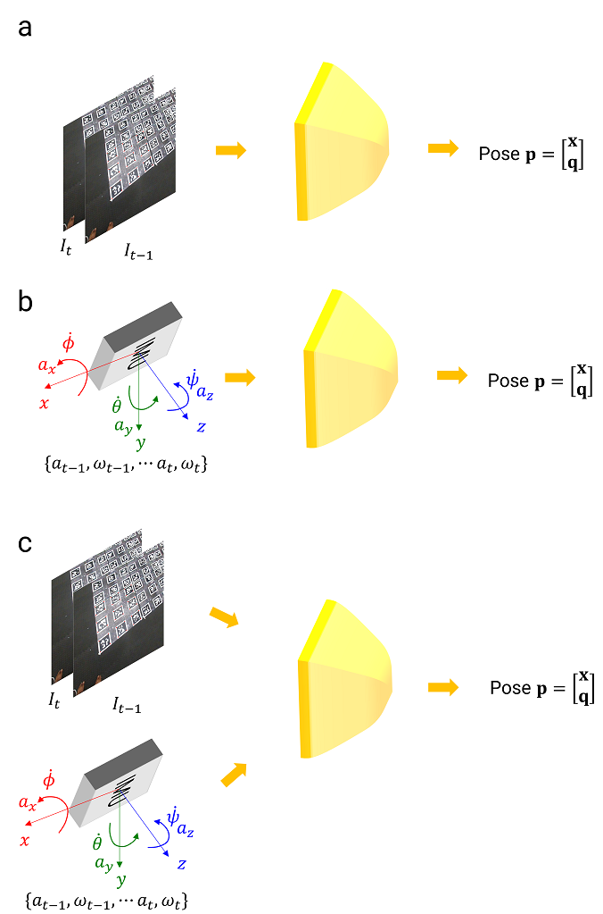

# Visual_Inertial_Odometry
Visual Inertial Odometry - Tradtional / Deep Learning 

### Some of the concepts 

Input - Two image frames and all IMU measurements \
Output - Relative pose between two camera frames

Generate Synthetic data in Blender (Realistic IMU Data and RGB Images ) with known poses between them

No mathematical modelling on IMU 

Use third party models for the same - Oystersim, GNSS INS Sim , Matlab's IMU Model

Estimating biases from Neural network hard  \
Assumption (Strong): Biases at the start of each sequence are zero. (PRGFlow, CUAHN-VIO, Deep Drone Acrobatics)

Assumption: Roll and Pitch angles does not exceed 45 , Yaw can be anything , Angular rate is less

Neglect  Realistic effects - Motion Blur, Depth of field or lighting changes (Use Global illumination lighting)

Fix Camera Matrix K and assume no distortion 

For faster render use Material preview mode. 
Finally once you obtain the relative poses between frames, you can obtain the odometry (to obtain trajectory in 3D) using dead-reckoning.

3 Tasks:
<ul>
<li> Using Vision data only </li>
<li> Using IMU data only </li>
<li> Using Vision + IMU data </li>
</ul>

